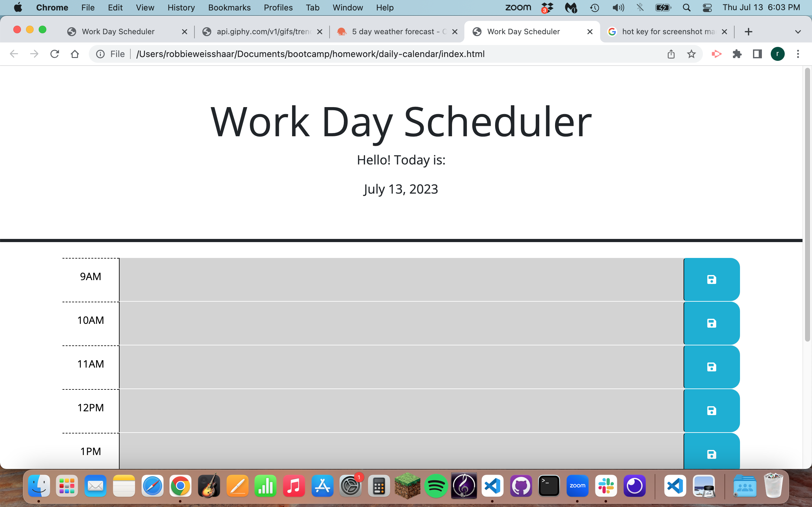

# Daily-Calendar

## Purpose:
- For this project, I wanted to create an app that would help me with my daily schedule, allowing me to stay more organized every day.

## Instructions for Use:
- The app is very simple to use. You select which time you would like to write an event in. You type the event you would like to save in the calendar, and then click the save button next to the time block. Now when you refresh the page, the content will be saved to the page using local storage. 

- The colors change depending on what time it is in your area. Green is a future event, red is current event, and gray is for a past event.

## Starter-Code:
- In this repo, there is a folder entitled "starter-code". This is the code that was given to me to work with (HTML, CSS, and basic JS). 

## Screen Shot:

## Link to Working Webpage:
https://rweisshaar1.github.io/daily-calendar/